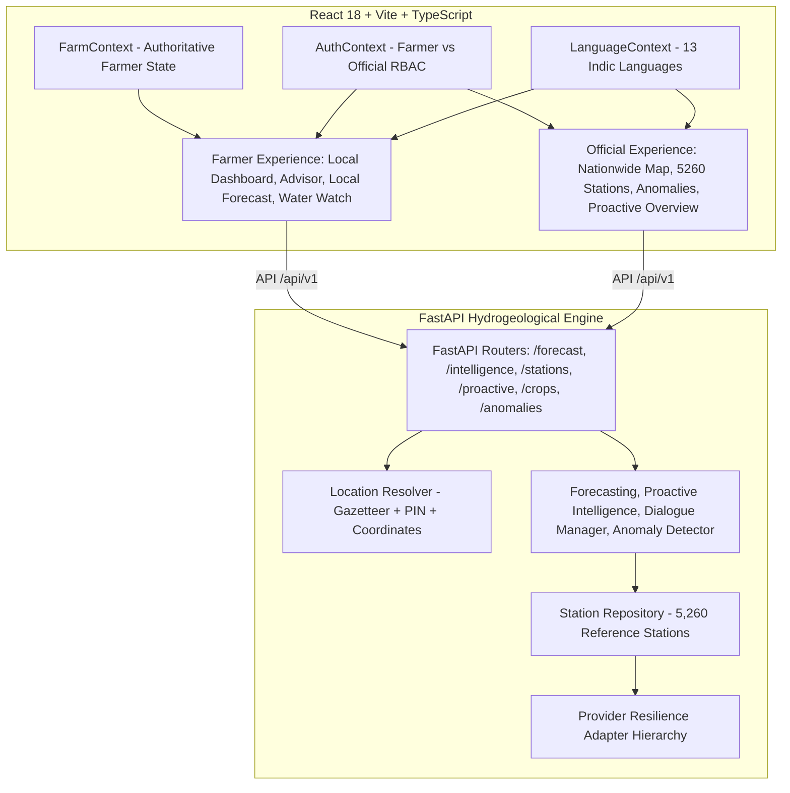

# JalKrishi AI — Master Project Continuation & Handoff Specification

```
LAST VERIFIED:     2026-09-05T07:40:00+05:30 (02:10:00 UTC)
GIT HEAD:          160ea2a76633678e4b574f8c7d84298926b40579 (Baseline: 15a5b3a)
ORIGIN/MAIN:       160ea2a76633678e4b574f8c7d84298926b40579
WORKTREE:          DIRTY (16 uncommitted modified frontend component files from in-progress i18n synchronization)
CURRENT PHASE:     Phase 19 / Multilingual Synchronization (In Progress)
NEXT TASK:         Complete Website-Wide Multilingual Synchronization & Browser QA Verification
```

---

## 1. Project Identity & Purpose

- **Project Name:** JalKrishi AI (JalKrishna AI)
- **Official Tagline:** *Know Your Water. Grow Smarter.*
- **Core Purpose:** Real-Time Groundwater Resource Evaluation Using DWLR Telemetry & Satellite Hydro-Agronomic Intelligence.
- **Foundational Architectural Principle:**
  > **DATABASE & NETWORK CAN BE NATIONWIDE — BUT FARMER EXPERIENCE MUST BE LOCAL.**
  - **Farmer Experience:** Centered strictly on *My Farm*, localized groundwater evidence, immediate well telemetry (or explicit satellite-assisted proxy), crop water budgeting, and actionable irrigation advice.
  - **Official Experience:** Nationwide spatial monitoring, 5,260 reference stations, administrative rollups (State/District), anomaly triage, and policy-level proactive alerts.

---

## 2. Current Git State & Baseline

- **Current Branch:** `main`
- **Current HEAD Commit:** `15a5b3acc1e634b41b98635b32161727ffd1c8ab` (`fix: render station forecast graph correctly`)
- **Remote `origin/main`:** `15a5b3acc1e634b41b98635b32161727ffd1c8ab`
- **Worktree Status:** `DIRTY`
  - 16 files modified in `src/components/` wrapping raw JSX strings with `t(...)` for multilingual support.
- **Uncommitted Modified Files:**
  1. `src/components/analytics/DistrictAnalysisTable.tsx`
  2. `src/components/analytics/StateComparisonTable.tsx`
  3. `src/components/crops/CropComparisonTable.tsx`
  4. `src/components/crops/CropDetailModal.tsx`
  5. `src/components/dashboard/HeroSection.tsx`
  6. `src/components/data/CSVValidatorPanel.tsx`
  7. `src/components/data/DataPipelineStatusCard.tsx`
  8. `src/components/groundwater/GroundwaterCoverageLegend.tsx`
  9. `src/components/groundwater/SatelliteGroundwaterPanel.tsx`
  10. `src/components/groundwater/UnifiedGroundwaterPanel.tsx`
  11. `src/components/help/AboutPlatformCard.tsx`
  12. `src/components/help/DataIssueForm.tsx`
  13. `src/components/help/FeedbackForm.tsx`
  14. `src/components/help/SystemArchitectureCard.tsx`
  15. `src/components/intelligence/ExecutiveWaterBrief.tsx`
  16. `src/components/system/DataSourcesPanel.tsx`
- **Untracked Files:** None.

---

## 3. Current Deployment & Environments

- **Frontend Production URL:** [https://jalkrishi-ai-1.onrender.com](https://jalkrishi-ai-1.onrender.com) (HTTP 200 OK)
- **Backend Production URL:** [https://jalkrishi-ai.onrender.com](https://jalkrishi-ai.onrender.com) (HTTP 200 OK)
- **Production API Base:** `https://jalkrishi-ai.onrender.com/api/v1`
- **Remote Git Repository:** `https://github.com/srujankadli/JALKRISHNA-AI.git`
- **Hosting Platform:** Render (Web Services)
- **Verified Production Health Check:**
  ```json
  GET https://jalkrishi-ai.onrender.com/health
  {
    "status": "healthy",
    "app_name": "JalKrishi AI — Groundwater Intelligence Platform",
    "version": "2.6.0",
    "environment": "production",
    "data_mode": "DEMO_SIMULATION",
    "active_source": "DEMO_SIMULATION",
    "station_count": 5260,
    "timestamp": "2026-09-05T02:08:57Z"
  }
  ```

---

## 4. Overall Architecture



---

## 5. Backend Structure

```
backend/
├── app/
│   ├── adapters/               # Provider resilience adapters (Gov DWLR, User Upload, Reference Simulation)
│   ├── config.py               # Application settings, CORS, environment variables
│   ├── engines/                # Core analytical and conversational engines
│   │   ├── conversational_agent.py
│   │   ├── dialogue_manager.py
│   │   ├── farmer_dialogue_manager.py
│   │   ├── farmer_intelligence.py
│   │   ├── forecasting.py      # Polynomial/Kalman depletion forecasting & projection envelope
│   │   ├── intent_router.py
│   │   └── proactive_engine.py # Multi-signal proactive risk and alert triage
│   ├── logging_config.py       # Structured logging setup
│   ├── main.py                 # FastAPI application factory, middleware, route inclusions
│   ├── models/
│   │   └── schemas.py          # Pydantic models matching TypeScript frontend contracts
│   ├── pipeline/               # Ingestion, validation, location resolution
│   │   ├── anomaly_detector.py # 5-class statistical anomaly detection
│   │   ├── data_quality.py     # Stuck sensor, null checks, outlier filtering
│   │   ├── dwlr_ingest.py      # Station repository loader (5,260 reference stations)
│   │   ├── ingestion_manager.py
│   │   └── location_resolver.py# Strict nationwide Indian gazetteer & PIN matching
│   └── routers/                # REST endpoints
│       ├── analytics.py
│       ├── anomalies.py
│       ├── auth.py
│       ├── crops.py
│       ├── data_pipeline.py
│       ├── farmer_intelligence.py
│       ├── forecast.py
│       ├── health.py
│       ├── insights.py
│       ├── location.py
│       ├── official_intelligence.py
│       ├── proactive_intelligence.py
│       ├── provider_resilience.py
│       ├── satellite_groundwater.py
│       ├── stations.py
│       ├── system.py
│       ├── voice.py
│       └── whatsapp.py
└── tests/                      # 134 automated unit & integration tests
```

---

## 6. Frontend Structure

```
src/
├── components/
│   ├── analytics/              # Regional groundwater distribution, state/district tables
│   ├── auth/                   # ProtectedOfficialRoute, RoleBadge, Login modals
│   ├── crops/                  # Water-smart crop recommendations, CropDetailModal
│   ├── dashboard/              # MyFarmOverviewCard, JalKrishiWaterWatchCard, HeroSection
│   ├── data/                   # DataPipelineStatusCard, CSVValidatorPanel
│   ├── farmer/                 # FarmerWaterAdvisor (Simple 10-Question Wizard)
│   ├── forecast/               # OfficialForecastView, RainfallOutlookCard, ForecastComparison
│   ├── groundwater/            # UnifiedGroundwaterPanel, SatelliteGroundwaterPanel
│   ├── help/                   # SystemArchitectureCard, DataSourcesPanel, FAQ
│   ├── intelligence/           # ExecutiveWaterBrief, ProactiveAlertCard
│   └── layout/                 # AppShell, Navbar, Sidebar, MobileNav
├── context/
│   ├── AuthContext.tsx         # Farmer vs Official user roles, tokens, state
│   ├── FarmContext.tsx         # Authoritative farmer location, crop, water profile
│   └── LanguageContext.tsx     # 13 Indic languages, directionality (LTR/RTL), dict lookup
├── i18n/
│   ├── translations.ts         # Core dictionary for 13 languages
│   └── translations_expanded.ts# Extended dictionary translations
├── pages/
│   ├── AnalyticsPage.tsx
│   ├── AnomaliesPage.tsx       # Early Warnings & Anomaly Detection
│   ├── CropAdvisorPage.tsx     # Crop selection + Farm Water Profile questionnaire
│   ├── Dashboard.tsx           # Adaptive layout: Farmer view vs Official view
│   ├── ForecastPage.tsx        # Dual mode: Farmer Local vs Station/Official Forecast
│   ├── GroundwaterMapPage.tsx  # Mapbox GL / Canvas 5,260 station visualization
│   ├── HelpPage.tsx
│   ├── LoginPage.tsx
│   ├── VoiceDemoPage.tsx
│   └── WhatsAppPage.tsx
├── services/                   # Axios/Fetch API clients matching backend schemas
│   ├── apiClient.ts
│   ├── cropService.ts
│   ├── forecastService.ts
│   ├── proactiveService.ts
│   └── stationService.ts
├── types/                      # TypeScript definitions matching Pydantic schemas
│   ├── api.ts
│   └── index.ts
└── utils/                      # Helper utilities (roleUtils, math, formatting)
```

---

## 7. Provider & Data Architecture

The system enforces a 3-tier fallback hierarchy handled by `app/adapters/provider_resilience.py`:

```
Government DWLR API (if configured)
        ↓
User Dataset CSV Upload (if uploaded)
        ↓
Reference Simulation Dataset (Default active)
```

- **Government DWLR API:** `NOT_CONFIGURED`.
- **Dataset Upload:** `AVAILABLE` (active dynamically when an official uploads a CSV).
- **Reference Simulation:** `ACTIVE_SIMULATION` (5,260 stations derived from historical CGWB network characteristics).
- **Remote Sensing / Satellite:** `SIMULATION_REFERENCE`.
- **IMD Weather:** `SIMULATION_REFERENCE`.
- **NASA GRACE:** `NOT_CONFIGURED`.
- **Sentinel-1 / InSAR:** `NOT_CONFIGURED`.

> [!CAUTION]
> **Data Honesty Rule:** 5,260 stations represent the **JalKrishi Reference Simulation Dataset**, NOT live connected government sensors. Never claim live telemetry unless an external API is configured.

---

## 8. Location Architecture & Strict Resolution

- **Elimination of Silent Fallbacks:** The platform **never** silently defaults to Kolar, Ballari, Shivamogga, Sangrur, or `(20.5937, 78.9629)`.
- **Resolution Modes:**
  1. `DIRECT_DWLR`: Farm within $\le 15\text{ km}$ of a valid reference station.
  2. `REGIONAL_DWLR_PROXIMAL`: Farm within $15\text{--}35\text{ km}$ of a station.
  3. `SATELLITE_ASSISTED_GRACE_MODIS`: Farm $> 35\text{ km}$ from stations (or no nearby stations exist).
- **Strict Verification:** Unverified queries (e.g., `gbtrshy`, `randomtown999`) return `is_resolved=False` with `status="UNRESOLVED"`, blocking any groundwater prediction from generating.
- **Ambiguity Triage:** Queries like `Rajpur` return `status="AMBIGUOUS"` and prompt the farmer with options across districts (Barwani MP, Balrampur CG, Dehradun UK).

---

## 9. FarmContext — Authoritative Farmer State

Defined in `src/context/FarmContext.tsx`:
- Holds the authoritative single source of truth for the farmer's session:
  - `farmLocation`: user-typed string.
  - `resolvedLocation`: coordinates, district, state, verification flag.
  - `selectedCrop`: active crop choice.
  - `waterProfile`: irrigation sources, groundwater reliance %, rainfall dependence.
  - `nearbyStations`: list of nearby DWLR stations.
  - `nearestStation`: closest monitoring station.
  - `evidenceMode`: `DIRECT_DWLR` vs `REGIONAL_EVIDENCE` vs `SATELLITE_ASSISTED`.
- **Invariants:** Switching languages, switching tabs, or toggling themes must **never** reset `FarmContext`.

---

## 10. Farmer vs. Official Separation

| Dimension | Farmer Experience | Official Experience |
| :--- | :--- | :--- |
| **Scope** | Hyperlocal (User's farm & immediate vicinity) | Nationwide & Regional rollups |
| **Primary Page** | My Farm Dashboard | Nationwide Network Map & Telemetry |
| **Forecasting** | Local Farm Groundwater Depth & Days-to-Critical | 5,260 Network Forecast & Administrative Trajectories |
| **Water Watch** | Simplified local card (Safe/Caution/Critical) | Regional Stress Index & Cluster Summaries |
| **Anomalies** | Hidden (or translated as simple advisories) | Full Anomaly Detection & Sensor Calibration Triage |
| **Station IDs** | Hidden or shown as proximal evidence distance | Complete Station Metadata & Engineering Codes |
| **Route Protection** | Public / Farmer login | `ProtectedOfficialRoute` enforced server & client-side |

---

## 11. Farm Water Profile

Integrated into the **Crop Advisor** (`src/components/farmer/FarmWaterProfileSection.tsx`):
- Tracks:
  - Water sources: Borewell/tube well, open well, canal, farm pond, river, community irrigation, rainwater only, tanker.
  - Groundwater dependence: `0-25%`, `26-50%`, `51-75%`, `76-100%`, or `Not sure`.
  - External dependence: Canal/tanker supply reliability.
  - Rainfall reliance: Rain-fed, partly irrigated, mostly irrigated, fully irrigated.
- Prevents invented numbers: If the user selects "Not sure", the system avoids fabricated percentages and relies on regional agro-climatic averages.

---

## 12. Water Watch

Component: `src/components/dashboard/JalKrishiWaterWatchCard.tsx`
- States: `NO_LOCATION`, `LOADING`, `SUCCESS`, `ERROR`.
- Without a verified location, it displays: *"Select your farm location to see Water Watch"*.
- Displays:
  1. Water status badge (Safe, Caution, Critical).
  2. What changed (e.g., trend in meters/month).
  3. Actionable recommendation (irrigation timing, recharge technique).
  4. Explicit model provenance and confidence.

---

## 13. Station & Regional Forecasting

Component: `src/pages/ForecastPage.tsx`
- **Dual Flow:**
  1. **Farmer Mode:** Uses `FarmContext`. Recomputes forecast when location changes (e.g., Nashik $\rightarrow$ Kochi $\rightarrow$ Jaipur $\rightarrow$ Ballari).
  2. **Station / Official Mode:** Navigated via URL query param `?stationId=<id>`. Overrides farmer view to show deep engineering metrics:
     - 7D, 30D, 60D, 90D depth projections (in mbgl).
     - **Model Projection Envelope** (not universal 95% CI).
     - **Station Reference Threshold** (station-specific aquifer limit, not fixed 25m).
     - Contextual historical rainfall (explicitly noted as historical context, not a rainfall forecast).

---

## 14. Anomaly Detection & Early Warnings

Component: `src/pages/AnomaliesPage.tsx`
- Productized as **Groundwater Anomaly Detection & Early Warnings** (not a raw database log).
- 5 Analytical Categories:
  1. Sudden Groundwater Drop (Depletion Spike)
  2. Possible Abnormal Extraction (Heavy pumping)
  3. Missing / Delayed Data (Telemetry outage)
  4. Possible Sensor Data Issue (Stuck reading / noise)
  5. Sudden Groundwater Rise (Recharge event / sensor flood)
- Severity triage: `Critical`, `High`, `Moderate`, `Data Quality`.

---

## 15. Proactive Groundwater Intelligence

Engine: `backend/app/engines/proactive_engine.py`
- Risk States: `STABLE`, `EMERGING_RISK`, `ESCALATING_RISK`, `CRITICAL_RISK`, `RECOVERY_SIGNAL`, `DATA_QUALITY_WARNING`.
- Multi-signal validation required before escalating alerts to high severity.
- Sensor quality warnings override depletion alerts to prevent false alarms.
- Provides specialized action playbooks for **Farmers**, **Officials**, and **Hydrologists**.

---

## 16. Satellite-Assisted Groundwater Estimation

- **Core Limitation:** Satellites do **not** directly measure a farmer's individual borewell water table.
- **Signal Fusion:**
  - GRACE/GRACE-FO: Regional terrestrial water storage anomaly ($\Delta\text{TWS}$).
  - Sentinel-1: InSAR subsidence proxy (when configured).
  - Optical/Thermal (MODIS/Landsat): NDVI/NDWI vegetative stress.
  - Spatial DWLR: Kriging / IDW interpolation from nearest available telemetry wells.
- **Output:** Clearly labeled as a *Model-Derived Spatial Estimate* with confidence indicators.

---

## 17. Crop & Irrigation Intelligence

Engine: `backend/app/routers/crops.py`
- Ranks suitable crops based on:
  1. Water table depth (mbgl) and 30-day depletion trajectory.
  2. Soil type and season (Kharif, Rabi, Zaid).
  3. Water footprint of the crop (low, medium, high).
  4. Farmer's water profile (borewell availability, canal access).
- Outputs explicit water savings, root zone depth, and crop sensitivity indices.

---

## 18. Multi-Lingual Voice & Text Dialogue

Engine: `backend/app/engines/farmer_dialogue_manager.py`
- Supports 13 Indian Languages:
  - English (`en`), Hindi (`hi`), Bengali (`bn`), Telugu (`te`), Marathi (`mr`), Tamil (`ta`), Gujarati (`gu`), Kannada (`kn`), Malayalam (`ml`), Punjabi (`pa`), Odia (`or`), Assamese (`as`), Urdu (`ur`).
- Cloud STT/TTS: `NOT_CONFIGURED` (falls back gracefully to browser Web Speech API).
- Dialogue loop handles 10 core farmer intent questions (water depth, crop selection, irrigation timing, recharge techniques, shortage risk).

---

## 19. WhatsApp Bot Integration

Component: `src/pages/WhatsAppPage.tsx`, Router: `backend/app/routers/whatsapp.py`
- Simulates WhatsApp conversational queries with Twilio webhook-compatible schema.
- Responds with localized markdown messages, irrigation schedules, and drought warnings.

---

## 20. Role-Based Access Control (RBAC)

- Handled by `src/context/AuthContext.tsx` and `backend/app/routers/auth.py`.
- Roles: `farmer`, `official`, `admin`.
- Farmers are restricted from viewing full raw network telemetry, unmasked station IDs, or administrative triage controls.
- Route guarding implemented via `ProtectedOfficialRoute.tsx`.

---

## 21. Current Unfinished Work: Multilingual Synchronization

> [!IMPORTANT]
> **STATUS: IN PROGRESS / UNCOMMITTED**
>
> The audit identified 326+ missing translation keys across 16 components.
> Currently, 16 frontend files have uncommitted changes wrapping JSX text into `t(...)`.
> Full dictionary keys across all 13 languages must be finalized in `src/i18n/translations.ts` and `src/i18n/translations_expanded.ts` before staging.

---

## 22. Known Platform Limitations

1. **In-Memory Auth:** Sessions and OTP tokens are currently stored in-memory in FastAPI without persistent Redis/PostgreSQL storage.
2. **Offline Mode:** PWA service workers cache basic shell assets, but offline groundwater estimation requires pre-cached regional models.
3. **Micro-Village Gazetteer:** Remote rural hamlets without PIN codes or tehsil mappings may require manual coordinate or district selection.
4. **Cloud Voice:** Cloud-based STT/TTS APIs are not configured; depends on client device speech synthesis.

---

## 23. Scientific Caveats & Disclaimers

- Groundwater conditions are model-projected based on historical CGWB DWLR telemetry, hydrostatic pressure equations, and spatial interpolation.
- Forecast envelopes represent numerical model simulations under historical rainfall assumptions; they are **not** guarantees of future water availability.
- Satellite-assisted assessments represent multi-spectral spatial proxies, **not** direct borewell depth measurements.

---

## 24. Security Limitations

- **MFA:** Not yet implemented.
- **Token Rotation:** Basic bearer token implementation without short-lived refresh token rotation.
- **Audit Logs:** Logged to application stdout, not yet shipped to a centralized immutable SIEM.
- **Rate Limiting:** Basic in-memory rate limiting; requires Redis-backed distributed rate limiter for production scale.

---

## 25. Testing Status & Verification Baseline

- **Backend Pytest Suite:** **134 passed**, 0 failed (in 62s).
- **TypeScript Static Check:** `npx tsc --noEmit` $\rightarrow$ **0 errors**.
- **Vite Production Build:** `npm run build` $\rightarrow$ **Clean build**, 0 errors (`dist/index.html` + chunks generated).
- **Live Deployment Health:** HTTP 200 OK on both frontend and backend.

---

## 26. Deployment Configuration

- **Render Backend Build Command:** `pip install -r backend/requirements.txt`
- **Render Backend Start Command:** `uvicorn app.main:app --host 0.0.0.0 --port $PORT` (working directory: `backend`)
- **Render Frontend Build Command:** `npm install && npm run build`
- **Render Frontend Publish Directory:** `dist`

---

## 27. Important Files Quick Reference

- `src/context/FarmContext.tsx` — Authoritative farmer location & crop state.
- `src/context/LanguageContext.tsx` — Multi-lingual dictionary and RTL/LTR state.
- `src/pages/ForecastPage.tsx` — Local farmer forecast vs station graph view.
- `backend/app/pipeline/location_resolver.py` — Nationwide Indian gazetteer & PIN resolver.
- `backend/app/engines/forecasting.py` — Kalman/Polynomial groundwater forecasting engine.
- `backend/app/engines/proactive_engine.py` — Multi-signal alert triage engine.
- `backend/app/adapters/provider_resilience.py` — 3-tier data source fallback manager.

---

## 28. Safe Modification Rules

1. **NEVER** re-introduce default fallback locations (e.g., Kolar, Ballari, `(20.5937, 78.9629)`).
2. **NEVER** expose raw official station tables to the farmer dashboard.
3. **NEVER** claim live NASA GRACE, Sentinel-1, or live government telemetry unless environment keys are actively configured.
4. **ALWAYS** run `npx tsc --noEmit` and `npm run build` before committing frontend changes.
5. **ALWAYS** run `pytest backend/tests` before committing backend changes.

---

## 29. Troubleshooting Guide

- **Symptom: Frontend shows "Connecting to Backend..."**
  - Check `VITE_API_URL` environment variable. In local development, ensure FastAPI is running on port 8000.
- **Symptom: "Location Not Verified" banner appears**
  - Verify that the entered location is a recognized Indian city, town, district, or 6-digit PIN code. Gibberish inputs are intentionally rejected.
- **Symptom: Station Forecast displays no data**
  - Ensure `?stationId=` matches a valid station ID in the 5,260 reference database.

---

## 30. Exact Next Recommended Task

1. **Complete Multilingual Synchronization:**
   - Inspect the 16 uncommitted files in `src/components/`.
   - Add all missing translation keys to `src/i18n/translations.ts` and `src/i18n/translations_expanded.ts` for all 13 languages.
   - Run browser QA verifying language transitions between English, Hindi, Kannada, and Urdu (RTL).
   - Ensure `FarmContext` location and role persist seamlessly across language toggles.
